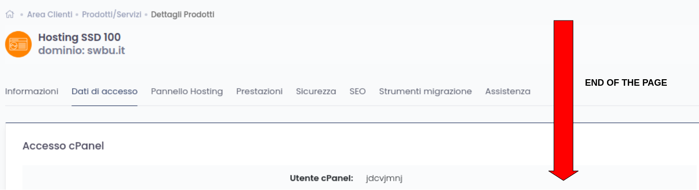
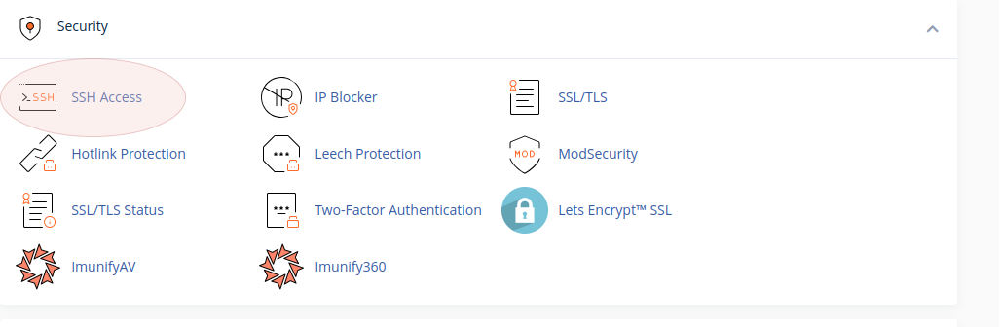
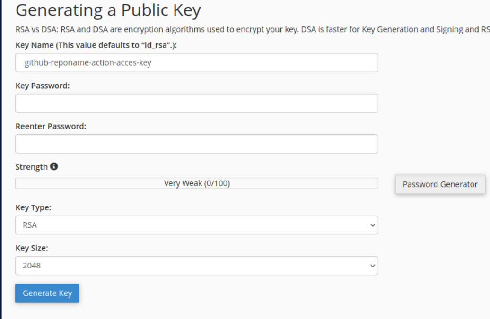
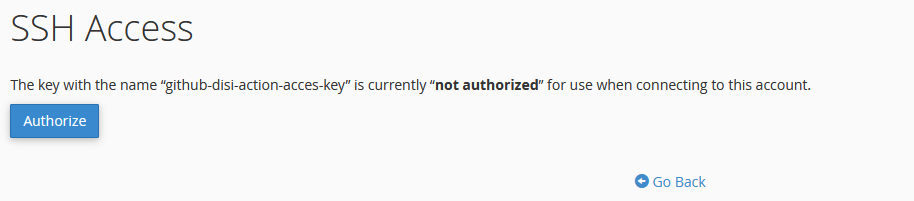

[](https://github.com/SamKirkland/FTP-Deploy-Action)

# sapere-temprasud
Sapere 3.0 - Business Intelligence

## How to deploy it

On this repo there is a GitHub action, if you push on the main branch, it will deploy automatically to production hosting with FTP.

## How to configure github actions(SSH CONFIGURATION)

This step must be added into  github action. Basically it just kills the process over SSH but it can be modified as it is needed.

```
- name: Kill Express Process
      uses: appleboy/ssh-action@v1.0.3
      with:
        host: ${{ secrets.SSH_HOST_NAME }}
        passphrase: ${{ secrets.SSH_PASSPHRASE }}
        username: ${{ secrets.SSH_USERNAME }}
        key: ${{ secrets.SSH_SECRET_KEY }}
        port: ${{ secrets.SSH_PORT }}
        script: |
          ps aux
          pkill -9 -f sapere
```
For configuring SSH , you should get the following information from netson server: <br />
- SSH_HOST_NAME
- SSH_USERNAME
- SSH_PORT<br />

<!-- end of the list -->


Those information on netson  can be find in the following image:<br />
<br />

After this, we should create .pem key from netson Cpanel-Security-SSHACCES<br />
<br />

Change the name of the key as follows and your **passphrase** is the password you put in the page.Be sure that you save it **secrets.SSH_PASSPHRASE**
<br />


After the creation authorize created key to activate it!
<br />

Copy the **privatekey** into **secrets.SSH_SECRET_KEY**.That's all :)
