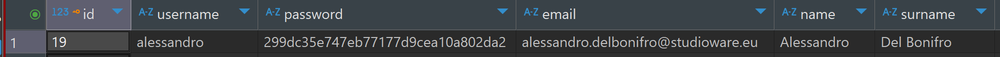
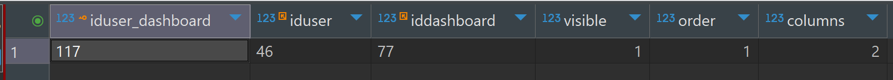
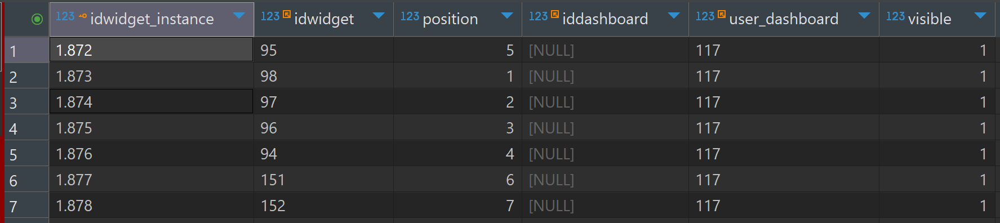
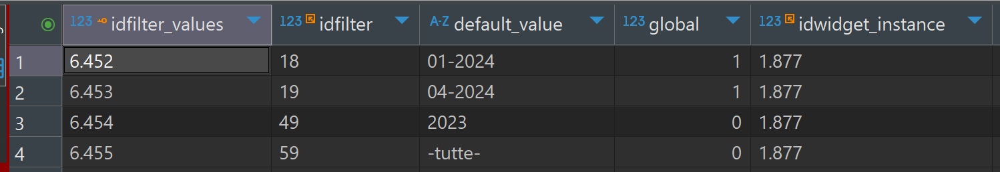
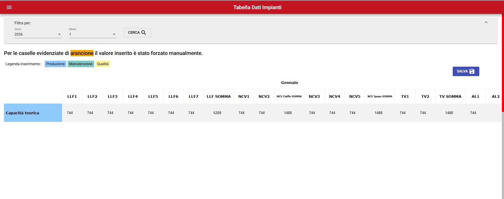
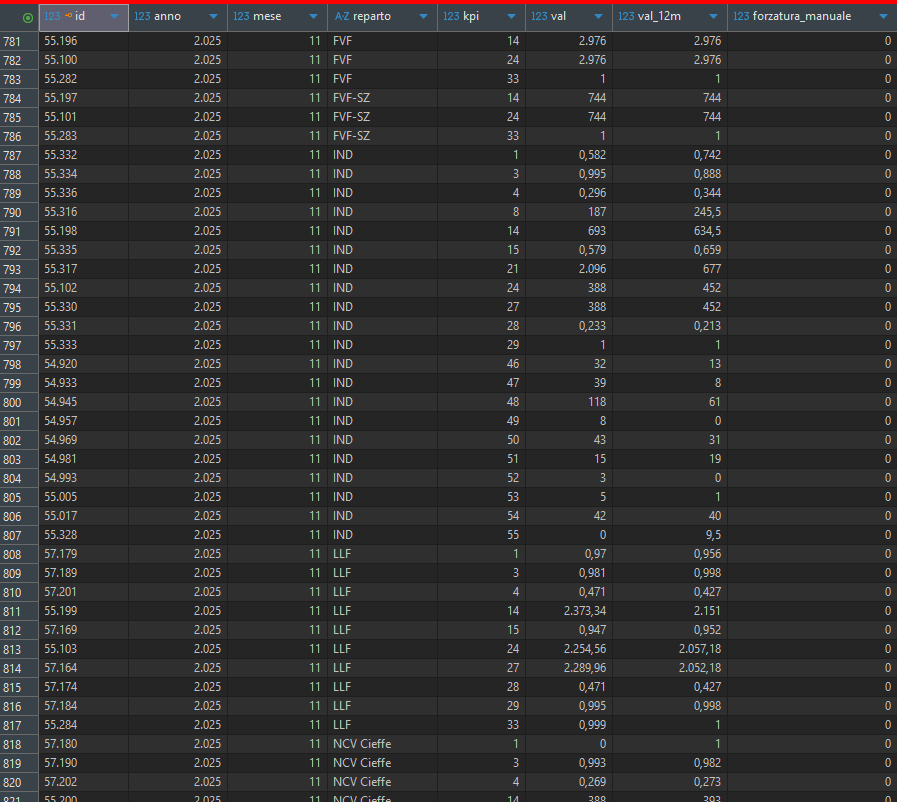
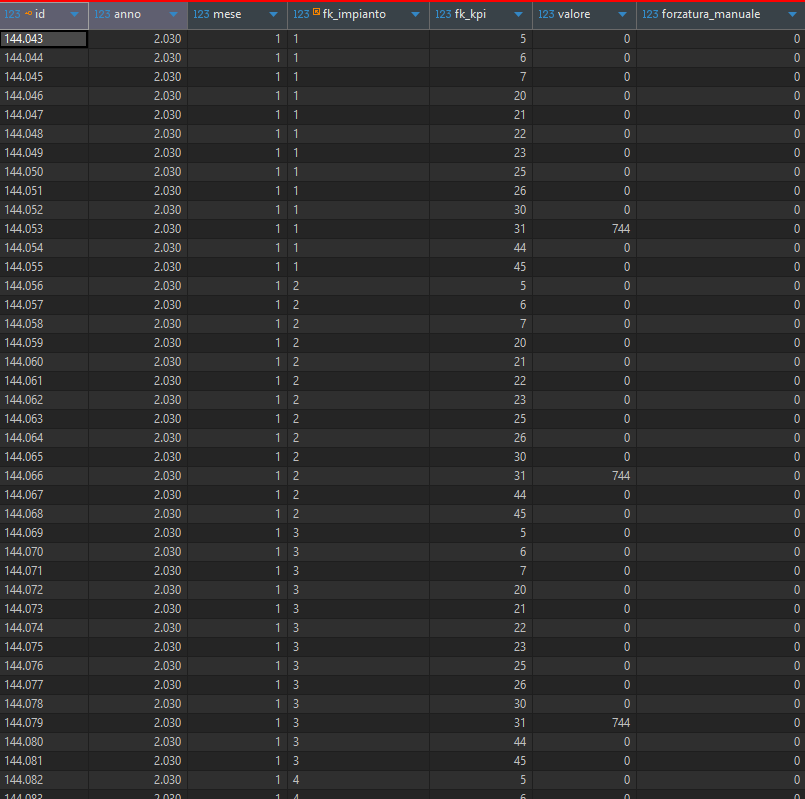

# Backend

## Create a new KPI

1. Add the KPI to the widget table
2. Configure the filters in `WidgetService.js`
3. Use Postman
4. Login with Postman
5. Use the endpoint to add the KPI to a dashboard
   `PUT /api/create_widget/manutenzione`
   with payload

```json
{
  "id": 214
}
```

Remember to specify the dashboard and the id of the KPI you have created.

6. Then you can add the route and the service if needed

# User creation

## Create a new User Manually

1. Access the `jdcvjmnj_sapere_temprasud` database.
2. Navigate to the `users` table.
3. Click on the option to add a new record.
4. Fill in the required fields such as `username`, `email`, `password`, etc.
5. Save the new user record.



## Associate the New User with a Dashboard

1. Access the `jdcvjmnj_sapere_temprasud` database.
2. Navigate to the `user_dashboard` table.
3. Click on the option to add a new record.
4. Fill in the `iduser` field with the ID of the newly created user.
5. Fill in the `iddashboard` field with the ID of the dashboard the user should have access to.
6. Save the new `user_dashboard` record.
7. If the user should have access to more than one dashboard, repeat steps 3-6 for each additional dashboard.



## Associate the User Dashboard with Widgets

1. Access the `jdcvjmnj_sapere_temprasud` database.
2. Navigate to the `widget_instance` table.
3. Click on the option to add a new record.
4. Fill in the `idwidget` field with the ID of the widget inside of the `widget` table.
5. Fill in the `position` field with the desired position of the widget on the dashboard.
6. Fill in the `user_dashboard` field with the ID of the user dashboard id previously created inside of the `user_dashboard` table.
7. Save the new `widget_instance` record.
8. If more widgets need to be associated with the user dashboard, repeat steps 3-7 for each additional widget.



## Associate Filters with the KPI

1. Access the `jdcvjmnj_sapere_temprasud` database.
2. Navigate to the `filter` table.
3. Choose the filters that you need to apply to the KPI.
4. Navigate to the `filter_values` table.
5. Click on the option to add a new record.
6. Fill in the `idfilter` field with the ID of the chosen filter.
7. Fill in the `default_value` field with the desired default value for the filter.
8. Fill in the `idwidget_instance` field with the ID of the widget instance previously created in the `widget_instance` table.
9. Save the new `filter_values` record.
10. If more filters need to be associated with the KPI, repeat steps 5-9 for each additional filter.



## Create User with API

### Create a new user via API

1. **User creation endpoint**:

- Method: `POST`
- URL: `/users/`
- Request body (JSON):
  ```json
  {
    "username": "username",
    "email": "user_email",
    "password": "user_password",
    "name": "name",
    "surname": "surname",
    "telephone": "telephone"
  }
  ```

2. **Request example**:
   ```sh
   curl -X POST http://localhost:3000/users \
   -H "Content-Type: application/json" \
   -d '{
     "username": "username",
     "email": "user_email",
     "password": "user_password",
     "name": "name",
     "surname": "surname",
     "telephone": "telephone"
   }'
   ```
3. **Successful response**:
   ```json
   {
     "id": 1,
     "username": "username",
     "email": "user_email",
     "name": "name",
     "surname": "surname",
     "telephone": "telephone"
   }
   ```

### Associate the new user with a dashboard

1. User-dashboard association endpoint:

   - Method: `POST`
   - URL: `/user_dashboard`
   - Request body (JSON):

   ```json
   {
     "iduser": "user_id",
     "iddashboard": "dashboard_id"
   }
   ```

2. **Request example**:
   ```sh
   curl -X POST http://localhost:3000/user_dashboard \
   -H "Content-Type: application/json" \
   -d '{
     "iduser": 1,
     "iddashboard": 1
   }'
   ```
3. **Successful response**:
   ```json
   {
     "iduser": 1,
     "iddashboard": 1
   }
   ```

### Create a widget instance for the user

1. User-dashboard association endpoint:

   - Method: `POST`
   - URL: `/widget_instance`
   - Request body (JSON):

   ```json
   {
     "dashboard_url": "dashboard_url",
     "widget": {
       "id": "widget_id",
       "id_user": "user_id"
     }
   }
   ```

2. **Request example**:
   ```sh
   curl -X POST http://localhost:3000/widget_instance \
   -H "Content-Type: application/json" \
   -d '{
     "dashboard_url": "dashboard_url",
     "widget": {
       "id": 1,
       "id_user": 1
       }
     }'
   ```
3. **Successful response**:
   ```json
   [
     {
       "idwidget_instance": 1,
       "iduser_dashboard": 1,
       "idwidget": 1
     }
   ]
   ```

### Associate filters with the KPI

1. Filter association endpoint:

   - Method: `POST`
   - URL: `/filter_values`
   - Request body (JSON):

   ```json
   {
     "idfilter": "filter_id",
     "default_value": "default_value",
     "idwidget_instance": "widget_instance_id"
   }
   ```

2. **Request example**:
   ```sh
   curl -X POST http://localhost:3000/filter_values \
   -H "Content-Type: application/json" \
   -d '{
     "idfilter": 1,
     "default_value": "default_value",
     "idwidget_instance": 1
   }'
   ```
3. **Successful response**:
   ```json
   {
     "idfilter": 1,
     "default_value": "default_value",
     "idwidget_instance": 1
   }
   ```

> These steps will allow you to create a user, associate them with a dashboard, create a widget instance for the user, and associate filters with the KPI using the API.

# Missing rows in "Tabelle Dati impianti / Tabelle Dati impianti IND / Tabelle Dati impianti FVF"

If the table shows missing/partial data for a new year (or the filters stop working), like in the screenshot below:



you need to create the missing rows in the `kpi_produzione` database table for the new year (one row per month for each `reparto`/`kpi`), initializing the values to `0` (same approach as previous years).



Since this can be ~960 rows per year (all combinations of `anno`/`mese`/`reparto`/`kpi`), the recommended approach is to copy the distinct `reparto`/`kpi` pairs from the previous year, generate months 1–12, set the values to `0`, and insert only the rows that don't already exist.

- `@anno_template`: the year used as a template (source)
- `@anno_new`: the year to be generated (target)

```sql
SET @anno_template = 2025;
SET @anno_new = 2026;

INSERT INTO kpi_produzione (anno, mese, reparto, kpi, val, val_12m, forzatura_manuale)
SELECT
  @anno_new AS anno,
  m.mese,
  t.reparto,
  t.kpi,
  0 AS val,
  0 AS val_12m,
  0 AS forzatura_manuale
FROM
  (SELECT 1 AS mese UNION ALL SELECT 2 UNION ALL SELECT 3 UNION ALL SELECT 4
   UNION ALL SELECT 5 UNION ALL SELECT 6 UNION ALL SELECT 7 UNION ALL SELECT 8
   UNION ALL SELECT 9 UNION ALL SELECT 10 UNION ALL SELECT 11 UNION ALL SELECT 12) AS m
CROSS JOIN
  (SELECT DISTINCT reparto, kpi
   FROM kpi_produzione
   WHERE anno = @anno_template) AS t
WHERE NOT EXISTS (
  SELECT 1
  FROM kpi_produzione AS x
  WHERE x.anno = @anno_new
    AND x.mese = m.mese
    AND x.reparto = t.reparto
    AND x.kpi = t.kpi
);

```

Then you also need to generate the rows in the `impianti_crud` table for the new year, based on the previous year.


Notes:

- default `valore` is `0`
- for `fk_kpi = 31` (hours/month) we set `valore = 744`
- the `NOT EXISTS` clause prevents duplicate inserts if the script is re-run

```sql
SET @anno_template = 2025;
SET @anno_new = 2026;

INSERT INTO impianti_crud (anno, mese, fk_impianto, fk_kpi, valore, forzatura_manuale)
SELECT
  @anno_new AS anno,
  t.mese,
  t.fk_impianto,
  t.fk_kpi,
  CASE
    WHEN t.fk_kpi = 31 THEN 744
    ELSE 0
  END AS valore,
  0 AS forzatura_manuale
FROM impianti_crud t
WHERE t.anno = @anno_template
  AND NOT EXISTS (
    SELECT 1
    FROM impianti_crud x
    WHERE x.anno = @anno_new
      AND x.mese = t.mese
      AND x.fk_impianto = t.fk_impianto
      AND x.fk_kpi = t.fk_kpi
  );
```
